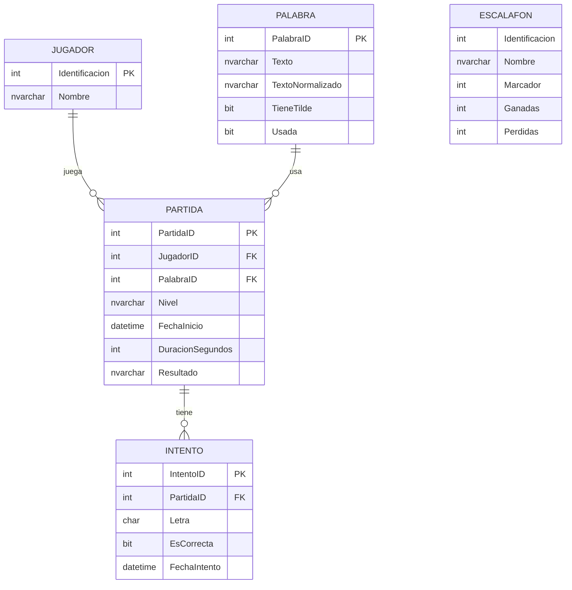

# 🎮 Proyecto Final - Juego del Ahorcado

**Curso:** Programación Avanzada  
**Código:** SC-601  
**Profesor:** Luis Andrés Rojas Matey  
**Grupo:** Eduardo Castro, Brandon Céspedes, Jimena Flores, Mariana Hidalgo

---
## 👥 Integrantes del Grupo

| Nombre            | Carné       | GitHub / Correo         |
|-------------------|-------------|-------------------------|
| Eduardo Castro    | FI13005258  | ecastro10015@ufide.ac.cr|
| Brandon Céspedes  | FH22012992  | bcespedes@traarepuestos.com     |
| Jimena Flores     | FH23014559  | jflores00335@ufide.ac.cr|
| Mariana Hidalgo   | FH23015127  | lhidalgo70015@ufide.ac.cr|

## 🧠 Descripción
---
Este es un proyecto web desarrollado en **ASP.NET MVC 5** (Framework 4.8.1) que simula el juego clásico del Ahorcado. Incluye:

- Módulo para gestión de palabras del diccionario.
- Registro de jugadores con sistema de puntuación.
- Creación de partidas con tres niveles de dificultad.
- Lógica de juego con validación de letras y condiciones de victoria/derrota.
- Escalafón con clasificación según rendimiento.

---

## 🛠 Tecnologías Utilizadas

- ASP.NET MVC 5 (.NET Framework 4.8.1)
- C#
- Entity Framework (Model First)
- SQL Server (LocalDB o Azure opcional)
- Bootstrap 5

---

## 📁 Estructura del Proyecto

```
Ahorcado/
├── Controllers/
│   ├── JugadoresController.cs
│   ├── PalabrasController.cs
│   └── PartidasController.cs
├── Models/
│   ├── Model1.edmx
│   └── EscalafonViewModel.cs
├── Views/
│   ├── Jugadores/
│   ├── Palabras/
│   ├── Partidas/
│   │   └── Escalafon.cshtml
│   └── Shared/_Layout.cshtml
├── Content/
├── Scripts/
└── README.md
```

---

## 📦 Instrucciones de Ejecución

### ✅ Requisitos

- Visual Studio 2022
- SQL Server Express o LocalDB
- .NET Framework 4.8.1

### 🛠 Restaurar Base de Datos

**Opción 1:** Ejecutar el script `AhorcadoDB.sql`

1. Crear una base de datos vacía llamada `AhorcadoDB`.
2. Ejecutar el script SQL incluido (`AhorcadoDB.sql`).

**Opción 2:** Restaurar desde archivo `.bak`

1. Usar SQL Server Management Studio (SSMS).
2. Restaurar la base desde el archivo `.bak`.

### ▶ Ejecutar el Proyecto

1. Abrir `Ahorcado.sln` en Visual Studio.
2. Confirmar que la cadena de conexión en `Web.config` apunta a la base `AhorcadoDB`.
3. Ejecutar el proyecto (`Ctrl + F5`).

---

## 🧠 Lógica del Juego

- Se escoge una palabra aleatoria no utilizada.
- Se muestran guiones bajos (`_`) representando las letras.
- El jugador selecciona letras por botones tipo teclado.
- El juego termina si:
  - Se adivina la palabra completa.
  - Se agotan los 5 intentos fallidos.
  - Se termina el tiempo según el nivel:

| Nivel   | Tiempo     |
|---------|------------|
| Fácil   | 90 segundos |
| Normal  | 60 segundos |
| Difícil | 30 segundos |

---

## 📊 Escalafón de Jugadores

- Puntos por victoria:
  - Fácil: +1
  - Normal: +2
  - Difícil: +3
- Puntos por derrota:
  - Fácil: -1
  - Normal: -2
  - Difícil: -3
- Se muestra un ranking con:

| Identificación | Nombre | Marcador | Ganadas | Perdidas |
|----------------|--------|----------|---------|----------|

---

## 🧬 Diagrama de Base de Datos (Mermaid)



---

## 🧾 Extras

- `AhorcadoDB.sql`: script con la estructura y 100 palabras + jugadores precargados.
- `.bak`: respaldo opcional de la base de datos.
- Código comentado para facilitar mantenimiento.
- Interfaz mejorada con Bootstrap 5.

---


---

## 📬 Contacto

Cualquier duda será resuelta en la exposición o mediante el Campus Virtual.
