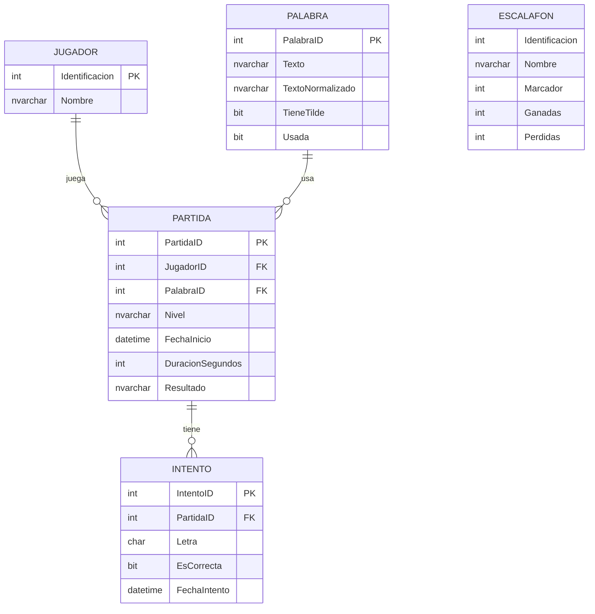

# **🎮 Proyecto Final - Juego del Ahorcado**

## **Universidad Fidélitas**  
**Curso:** SC-601 - Programación Avanzada 

**Profesor:** Rojas Matey, Luis Andrés 
**Estudiantes:** 
- Castro Rojas, Eduardo Francisco
- Céspedes Morales, Brandon Steven
- Flores Carmona, Jimena
- Hidalgo De La O, Mariana

**Laboratorio:** M (6PM - 9PM) 
**Grupo:** No. 9 
**Cuatrimestre:** II - 2025  

**Fecha de Entrega:** Miércoles 13 de agosto 2025, 6pm

---

## 👥 Integrantes del Grupo 1

| Nombre            | Carné       | GitHub / Correo         |
|-------------------|-------------|-------------------------|
| Eduardo Castro    | FI13005258  | ecastro10015@ufide.ac.cr|
| Brandon Céspedes  | FH22012992  | bcespedes@traarepuestos.com |
| Jimena Flores     | FH23014559  | jflores00335@ufide.ac.cr|
| Mariana Hidalgo   | FH23015127  | lhidalgo70015@ufide.ac.cr|

---

## 🧠 Descripción

Este es un proyecto web desarrollado en **ASP.NET MVC 5** (Framework 4.8.1) que simula el juego clásico del Ahorcado. Incluye:

- Módulo para gestión de palabras del diccionario.
- Registro de jugadores con sistema de puntuación.
- Creación de partidas con tres niveles de dificultad.
- Lógica de juego con validación de letras y condiciones de victoria/derrota.
- Escalafón con clasificación según rendimiento.

---

## 📁 Estructura del Proyecto

```
Ahorcado/
├── Controllers/
│   ├── JugadoresController.cs
│   ├── PalabrasController.cs
│   └── PartidasController.cs
├── Models/
│   ├── Model1.edmx
│   └── EscalafonViewModel.cs
├── Views/
│   ├── Jugadores/
│   ├── Palabras/
│   ├── Partidas/
│   │   └── Escalafon.cshtml
│   └── Shared/_Layout.cshtml
├── Content/
├── Scripts/
└── README.md
```

---

## 🛠️ Especificaciones Técnicas

- ASP.NET MVC 5 (.NET Framework 4.8.1)
- Lenguaje C#
- Entity Framework (Model First)
- SQL Server (LocalDB o Azure opcional)
- Bootstrap 5

---

## 📦 Instrucciones de Ejecución

### ✅ Requisitos

- Visual Studio 2022
- SQL Server Express o LocalDB
- .NET Framework 4.8.1

### ⚙️ Restauración de la Base de Datos

**Opción 1:** Ejecutar el script `AhorcadoDB.sql`

1. Crear una base de datos vacía llamada `AhorcadoDB`.
2. Ejecutar el script SQL incluido (`AhorcadoDB.sql`).

**Opción 2:** Restaurar desde archivo `.bak`

1. Usar SQL Server Management Studio (SSMS).
2. Restaurar la base desde el archivo `.bak`.

### ▶ Ejecutar el Proyecto

1. Abrir `Ahorcado.sln` en Visual Studio.
2. Confirmar que la cadena de conexión en `Web.config` apunta a la base `AhorcadoDB`.
3. Ejecutar el proyecto (`Ctrl + F5`).

---

## 🧠 Lógica del Juego

- Se escoge una palabra aleatoria no utilizada.
- Se muestran guiones bajos (`_`) representando las letras.
- El jugador selecciona letras por botones tipo teclado.
- El juego termina si:
  - Se adivina la palabra completa.
  - Se agotan los 5 intentos fallidos.
  - Se termina el tiempo según el nivel:

| Nivel   | Tiempo     |
|---------|------------|
| Fácil   | 90 segundos |
| Normal  | 60 segundos |
| Difícil | 30 segundos |

---

## 📊 Escalafón de Jugadores

- Puntos por victoria:
  - Fácil: +1
  - Normal: +2
  - Difícil: +3
- Puntos por derrota:
  - Fácil: -1
  - Normal: -2
  - Difícil: -3
- Se muestra un ranking con:

| Identificación | Nombre | Marcador | Ganadas | Perdidas |
|----------------|--------|----------|---------|----------|

---

## ✳️ Diagrama de la Base de Datos (Mermaid)



---

## 🧾 Información Adicional

- `AhorcadoDB.sql`: script con la estructura y 100 palabras + jugadores precargados.
- `.bak`: respaldo opcional de la base de datos.
- Código comentado para facilitar mantenimiento.
- Interfaz mejorada con Bootstrap 5.

---

## 📚 Recursos de Apoyo y Referencias

### Repositorio del Proyecto  
**Grupo 1 - Ahorcado**  
* Link: https://github.com/EduardoCR1994/Ahorcado.git
* [Enlace al repositorio GitHub](https://github.com/EduardoCR1994/Ahorcado.git)

---

## 🤖 Prompt del ChatBot de IA utilizada para la Solución: _Copilot_

**Descripción:**  
Durante el desarrollo se consultaron recursos complementarios para implementar correctamente la lógica, solucionar errores y mejorar el diseño.

### 🟩 Prompt 1

**Entrada:**  
¿Puedes generar una clase Partida en C# para un juego de ahorcado? Debe incluir ID, jugador, palabra, nivel, duración, fecha de inicio y resultado.

**Salida:**  
Claro. La clase incluiría propiedades como PartidaID, JugadorID, PalabraID, Nivel, FechaInicio, DuracionSegundos y Resultado. Estas permiten registrar cada partida con su contexto y resultado final.

---

### 🟩 Prompt 2

**Entrada:**  
Crea un controlador MVC llamado PartidasController que permita iniciar una partida, seleccionar una palabra aleatoria no usada y registrar intentos.

**Salida:**  
Perfecto. El controlador tendría una acción para iniciar la partida, buscar una palabra no usada, asignarla al jugador y registrar los intentos conforme se envían. También incluiría redirección a la vista de juego.

---

### 🟩 Prompt 3

**Entrada:**  
Diseña una vista Razor para mostrar la palabra oculta como guiones bajos, los intentos restantes, y un teclado visual con botones de letras.

**Salida:**  
La vista mostraría la palabra con guiones bajos según las letras adivinadas, un contador de intentos restantes, y un teclado con botones de la A a la Z para seleccionar letras. Todo con diseño responsivo.

---

### 🟩 Prompt 4

**Entrada:**  
Genera una vista que muestre el ranking de jugadores con nombre, marcador, partidas ganadas y perdidas.

**Salida:**  
Se mostraría una tabla con columnas para identificación, nombre, marcador, ganadas y perdidas. El escalafón se ordenaría por marcador descendente para destacar el mejor rendimiento.

---

### 🟩 Prompt 5

**Entrada:**  
Sugiere mejoras visuales para la vista del juego del ahorcado usando Bootstrap 5. Incluye colores en hexadecimal para fondo, botones y texto.

**Salida:**  
Se recomienda usar un fondo claro (#f8f9fa), botones azules (#007bff) con texto blanco (#ffffff), y efectos hover más oscuros (#0056b3). La estructura debe ser centrada y responsiva para buena experiencia de usuario.

---

### 🟩 Prompt 6

**Entrada:**  
Dame una lista de 50 palabras en español: 25 con tildes y 25 sin tildes. Incluye una propiedad TieneTilde y una versión normalizada sin tilde.

**Salida:**  
Aquí tienes 50 palabras. Las primeras 25 incluyen tildes como “camión”, “teléfono”, “corazón”, y las siguientes 25 son sin tildes como “mesa”, “sol”, “puerta”. Cada palabra tiene su versión normalizada y una marca booleana indicando si tiene tilde.

---

### 🟩 Prompt 7

**Entrada:**  
Genera una lista de 10 jugadores con identificaciones numéricas y nombres completos realistas para pruebas en base de datos.

**Salida:**  
Aquí tienes 10 jugadores con nombres como “Jimena”, “Francisco”, “Mariana”, "Brandon", cada uno con un número de identificación único para simular registros reales en el sistema.

---

### 🟩 Prompt 8

**Entrada:**  
Explica cómo aplicar el CSS ya definido en la clase `.btn-nueva-partida` a un nuevo botón “Volver a jugar”, de manera que **herede todo el estilo original** (degradado, bordes redondeados, sombra, hover y transición) sin escribir CSS adicional.

**Salida:**  
Para reutilizar el CSS de `.btn-nueva-partida`, simplemente asigna esa clase al nuevo botón en tu HTML. Por ejemplo:  
```html
<a href="URL_DEL_JUEGO" class="btn btn-nueva-partida btn-lg px-4 py-2">
    <i class="fas fa-redo"></i> Volver a jugar
</a>
---
---
## 📬 Contacto

Cualquier duda será resuelta en la exposición o mediante el Campus Virtual.
